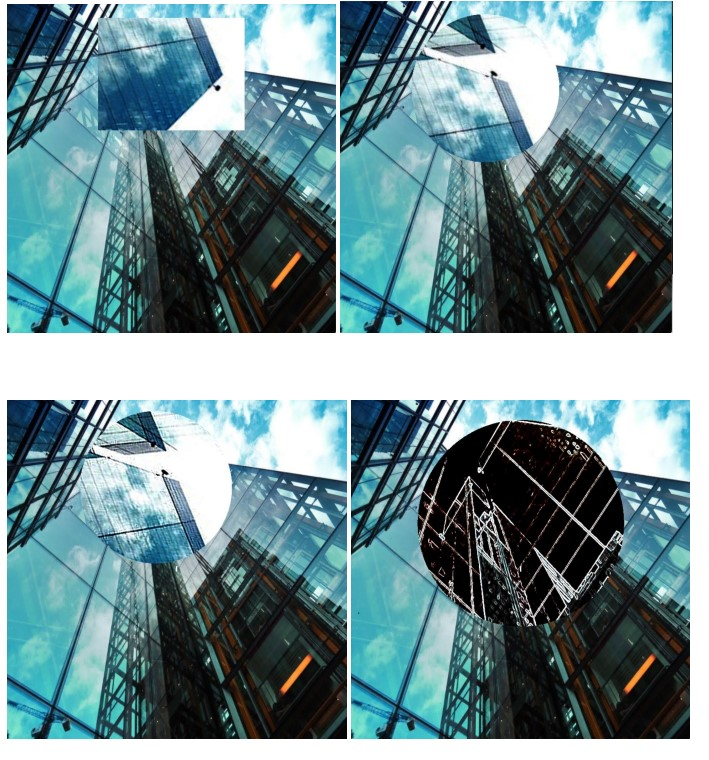

# CS457-Shaders

## Shaders Projects Using GLSL  

### Bump Mapping Examples
This is an example of turing a quad into pleats using shaders. This object uses bump mapping to give the look of having a wrinkled surface. It uses the vertex shader to displace the quad's vertices and give it a "pleat" look. 

### Geometry Shaders Examples
An example of geometry shaders applied on a bunny object. The shader changes the geometry into a blocky, cylinder shape.  

Example of displacement of certain parts of the bunny object, morphing the bunny object into a sphere, applying toon-shading lighting to the object, and transforming the geometry of the bunny. 

### Cube Mapping Examples
Fun cube mapping example with pleats! Using a cube map, the pleats are able to reflect, refract, and have displacement applied to the quad. 

### Vertex Shader Examples
Simple vertex shader example to display elliptical dots on a sphere.

Apply "Noise" to the sphere above to create a cool effect. Use shaders to discard certain pixles. 

### Image Manipulation
Applying different image manipulation techniques, such as magnification, rotation, edge detection, shape modifier, to an image. 

### Pixilation

This shows pixelating certain parts of the texture on the bunny, with the ability to change how the texture is being pixelated.

